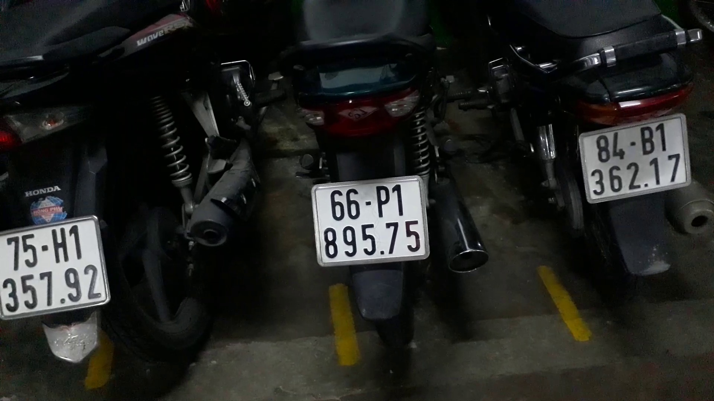
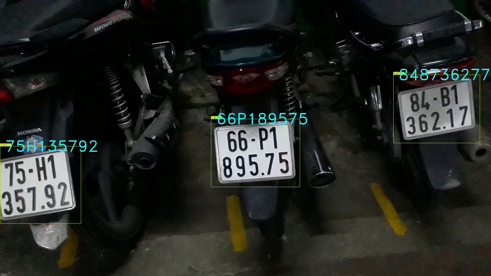

This project is for the ultimate manner of identifying the number plate. Combining YOLOv7 object detection, Hough transform alignment, and CNN character recognition
	

<i>Figure. Input license plate </i>

<i>Figure. Final result </i>

* Remember to set up neccesary libraries in `requirements.txt` 
* Download the model used for YOLOv7 model `LP_detect_yolov7_500img.pt` and CNN model `weight.h5` in Git RELEASES and put them in the right path like in the code
* To test on image, run `main_image.py`. Remember to change the path of image.
* In `data` folder you can find `data.yaml` needed for YOLOv7 training and folder `test` including test images. Feel free to use it
* `src` folder are codes for CNN model. put the CNN model here
* `utils` and `models` are for YOLOv7. They're a part of original YOLO. However, don't care about them, you can use YOLOv7 to derectly detect number plates with `detect.py`.
* `Preprocess.py`, `utils_LP.py` and `vid2img.py` are util files. Spend time to explore them.
* `yolo-v7-number-plate-detection.ipynb` is the training of YOLOv7
